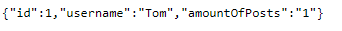

# Kubernetes networking

## Description
This part is related to an **Ingress** object that manages external access to the services in a cluster.<br />
Ingress exposes HTTP and HTTPS routes from outside the cluster to services within the cluster. <br />
Traffic routing is controlled by rules defined on the Ingress resource.

## Getting started

The Ingress controller is needed to satisfy an Ingress. Only creating an Ingress resource has no effect.<br />
Here an Ingress controller such as ingress-nginx is used.

## Deploy system on local k8s cluster

Firstly, you have to deploy system on local k8s cluster using helm chart by executing the command from root project folder

        helm install k8s-helm-test .\k8s-networking\

To use an ingress-nginx-controller you need to run the following command 

        helm upgrade --install ingress-nginx ingress-nginx --repo https://kubernetes.github.io/ingress-nginx --namespace k8s-course --create-namespace

To check whether system is up and running, run this command```kubectl get all -n k8s-course```. 

Now you can send GET request e.g ``http://localhost/user-app/users/1`` via browser and you should see response like this



